# Unsupervised Learning on Wholesale Customers Dataset-Clustering

This project applies **K-Means** and **Hierarchical Clustering** to segment wholesale customers based on purchasing patterns. The analysis includes **data preprocessing**, **dimensionality reduction (PCA)**, **hyperparameter tuning**, and **visualisation of clusters**.  

---

## 📊 Dataset

- **Source**: Wholesale Customers dataset  
- **Features**: Fresh, Milk, Grocery, Frozen, Detergents_Paper, Delicassen  
- **Goal**: Group customers into meaningful segments for business insights  

---

## 🔧 Preprocessing Steps

- Checked for missing values and duplicates  
- Feature scaling (StandardScaler)  
- Principal Component Analysis (PCA) for dimensionality reduction  

---

## 📚 Libraries Used

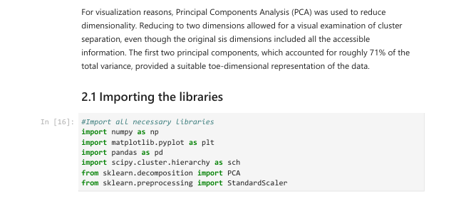  

---

## 📈 Visualisations & Outputs

### 📌 Introduction
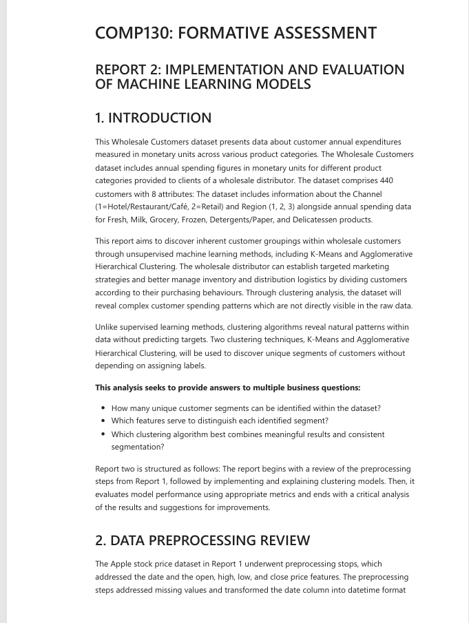  

### 📊 Dataset Overview
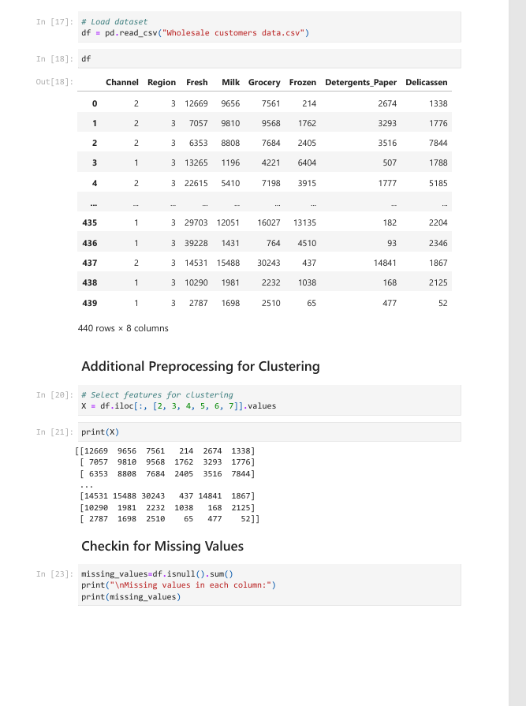  

### 🧹 Data Cleaning
  

### ⚙️ Hyperparameter Tuning
  
  

### 📍 K-Means Clustering
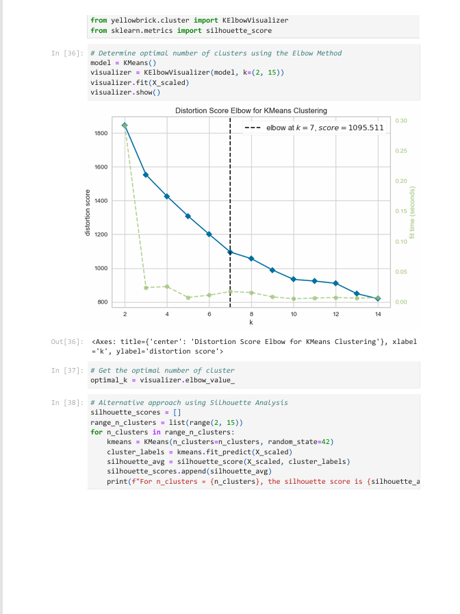  
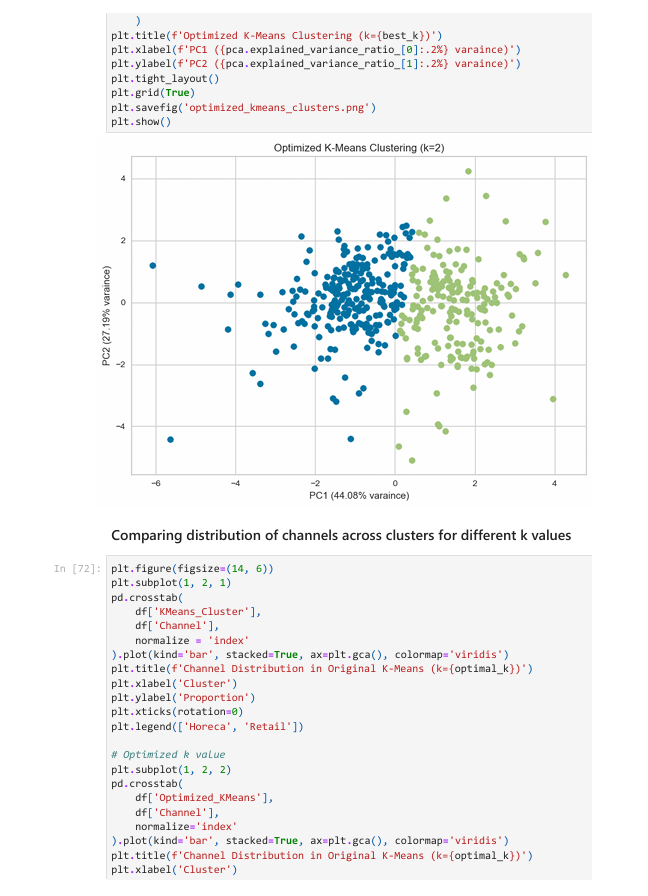  
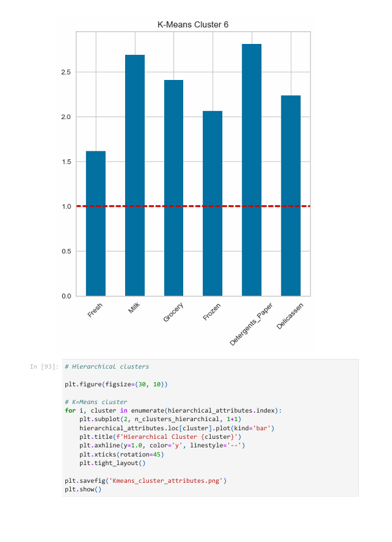  
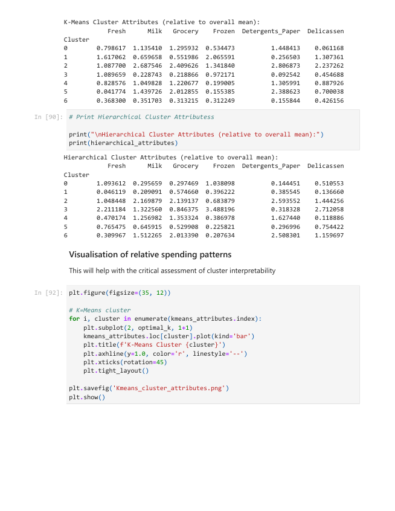  
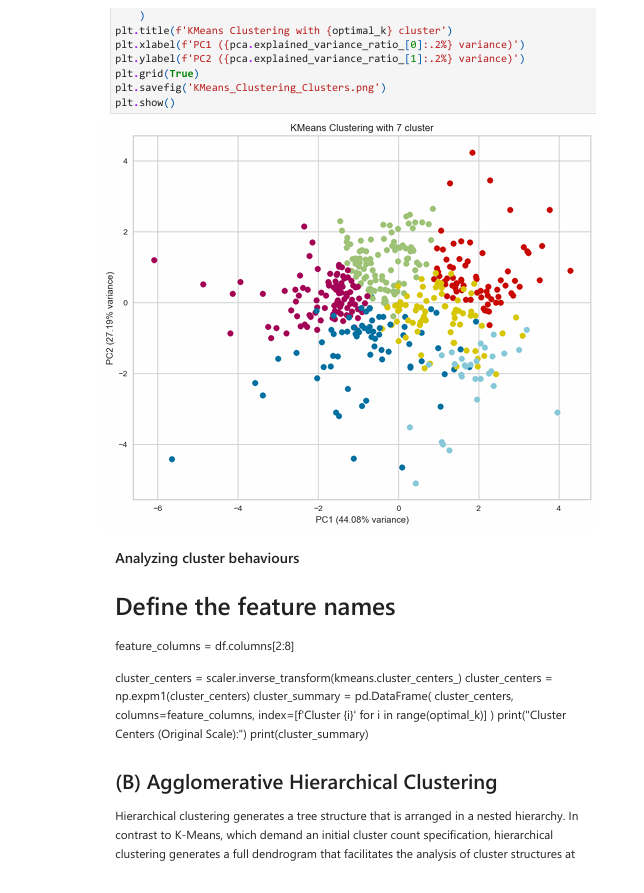  

### 📍 Hierarchical Clustering
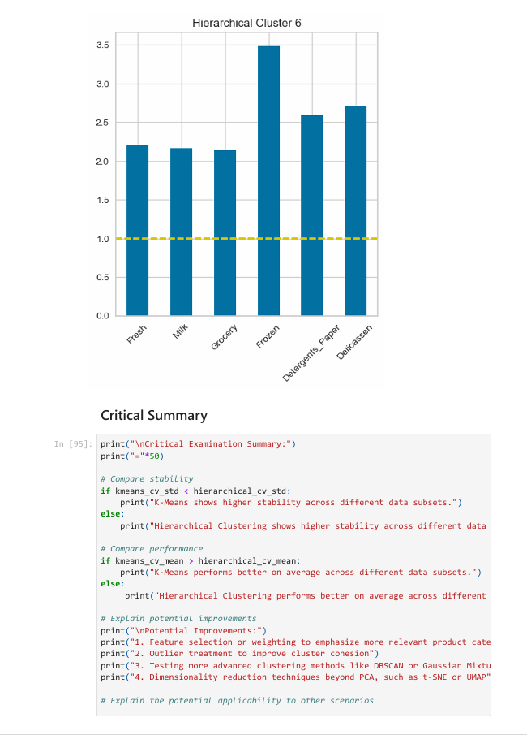  

### 🧮 Model Evaluation & Comparison
  
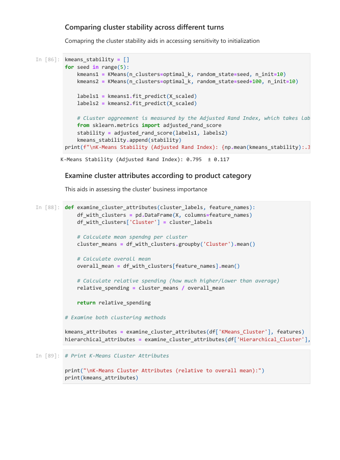  

### 📑 Report Screenshots
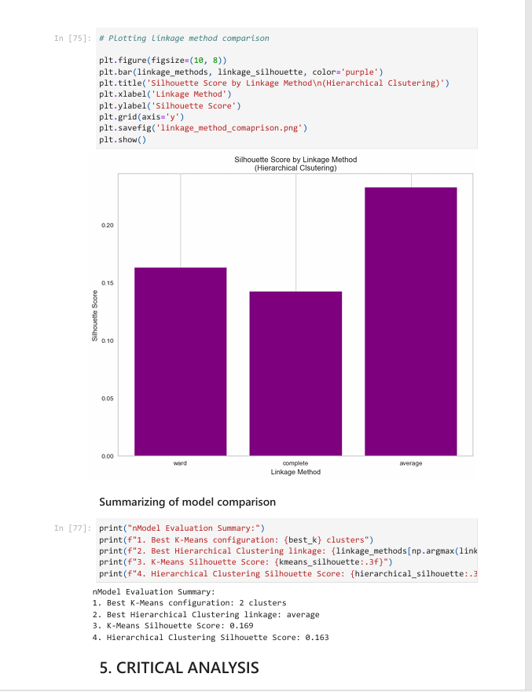  
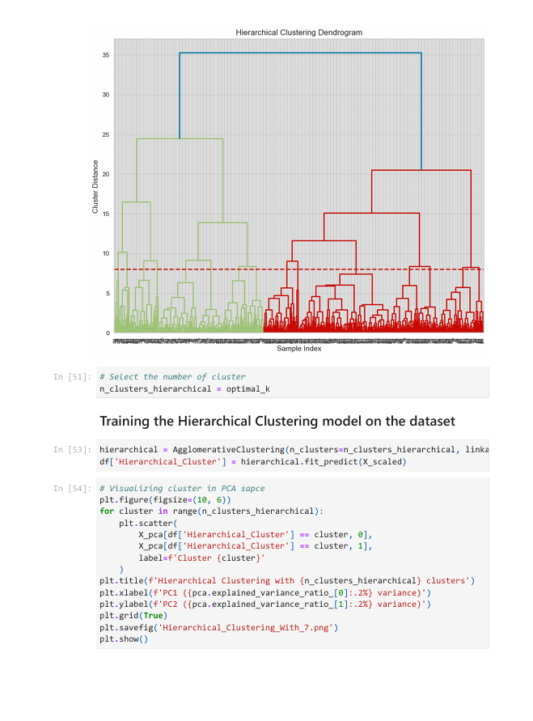  
  
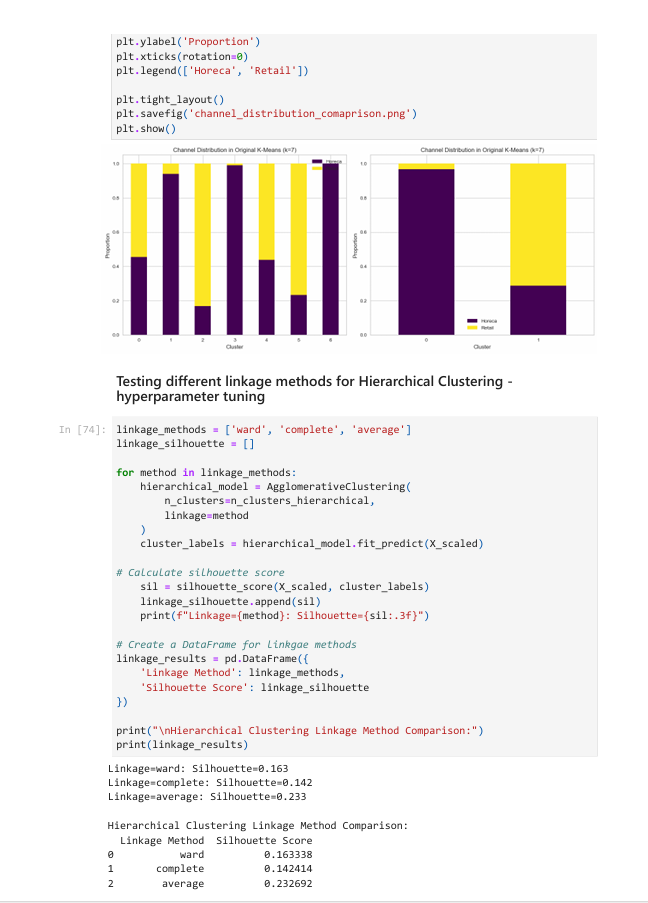  
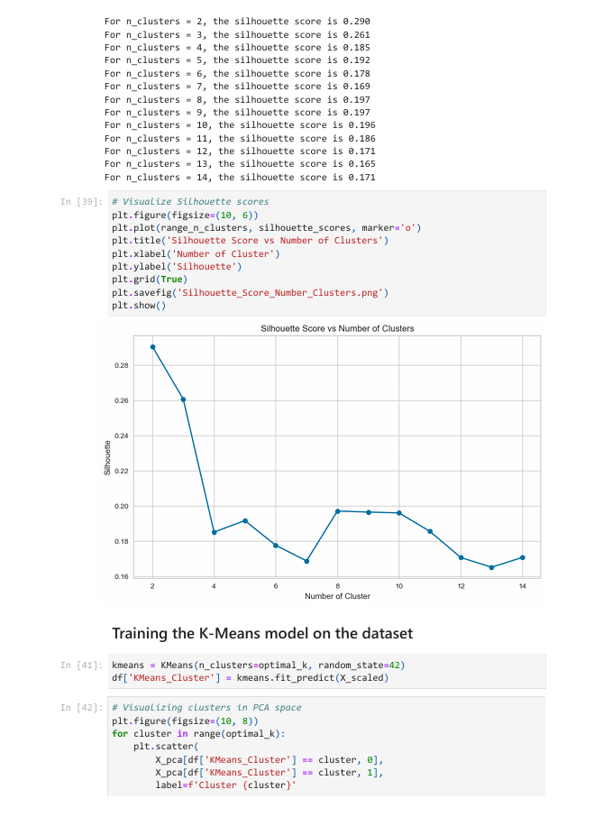  
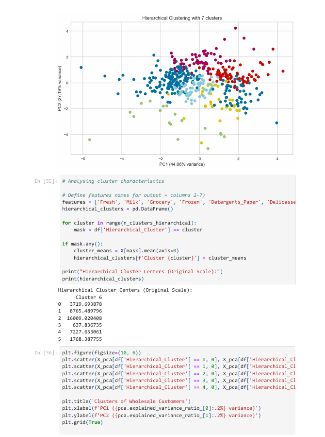  

### 📌 PCA Visualisation
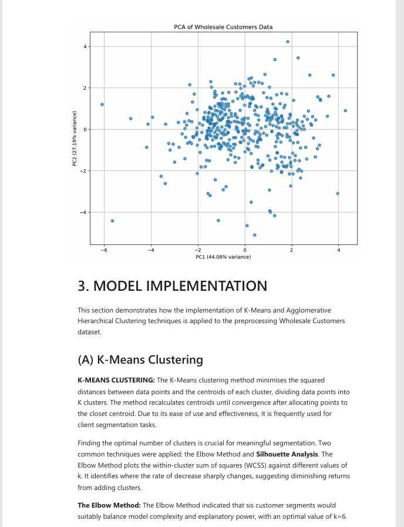  

---

## 🧮 Models Used

- **K-Means Clustering**
- **Hierarchical Clustering**

---

## 🧾 Evaluation Metrics

- **Silhouette Score**
- **Cluster Interpretability**
- **Visual Separation in PCA Space**

---

## 📝 Conclusion

The analysis revealed distinct customer segments based on purchasing patterns.  
K-Means provided clear and interpretable clusters with an optimal number of clusters determined via the elbow method and silhouette score.  
Hierarchical clustering offered additional insights into customer relationships and subgroupings.

---

## 📁 Files

- `/screenshots/`: Markdown report visuals (text, code blocks, and output)
- `requirements.txt`: Python dependencies

---

## ▶️ Installation

Clone the repository and install dependencies:

```bash
git clone https://github.com/USERNAME/Unsupervised-Learning-Wholesale-Customers-Clustering.git
cd Unsupervised-Learning-Wholesale-Customers-Clustering
pip install -r requirements.txt

